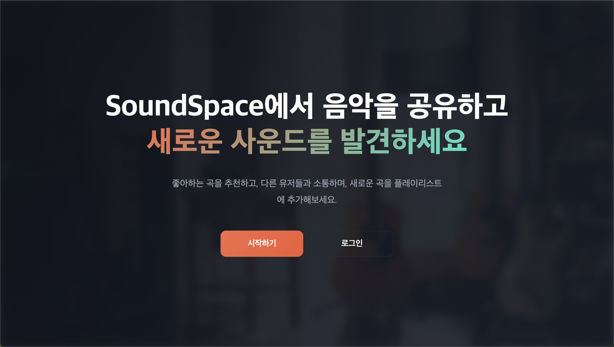
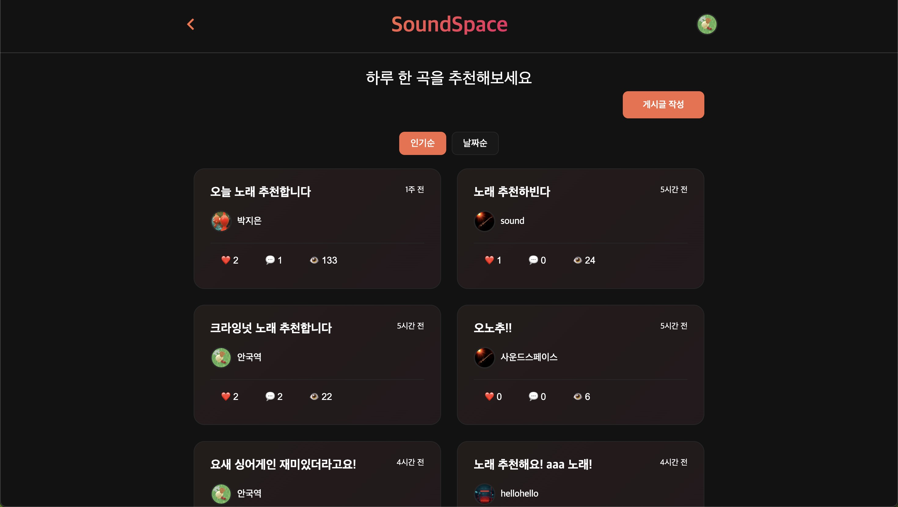

# Sound Space Frontend

노래 추천 및 플레이리스트 공유 커뮤니티 사운드 스페이스의 프론트엔드 레포지토리입니다.  
리액트 `fiber` 아키텍처에 영감을 받은 버츄얼 돔을 활용해 diffing 알고리즘을 구현했고,  
이를 통해 vanilla js 로 spa 와 virtual dom 을 구현했습니다.

## 1. 프로젝트 개요

- **프로젝트 목적**
  - 하루의 노래 추천
- **주요 기능**
  - 회원 가입 / 로그인 (JWT 기반 인증)
  - 인피니티 스크롤링
  - 게시판 기능 및 댓글, 추천 기능
  - 프로필 수정 및 이미지 업로드

## 2. 기술 스택

- Vanilla JS (Custom Virtual DOM & Fiber-like Instance)
- SWC (JSX → createElement 변환용)

## 3. 상세 화면

### 3.1 스크린샷




### 3.2 구현 영상

https://youtu.be/_ruGQ9Sz7FI

## 4. Virtual DOM 아키텍처

### 4.1 핵심 개념

이 프로젝트는 React Fiber 아키텍처에서 영감을 받아 Virtual DOM과 reconciler를 직접 구현했습니다.

#### 용어 정의

- **VDom (Virtual DOM)**: 실제 DOM을 그리기 위한 설계도 역할을 하는 객체 (매번 새로 생성)
- **Instance**: 작업의 단위가 되는 fiber-like 객체로, 상태와 DOM 포인터를 보관 (최대한 재사용)
- **Reconciler**: 이전 Instance와 새로운 VDom을 비교하여 변경사항을 실제 DOM에 반영

### 4.2 프로젝트 구조

```
src/core/
├── GlobalState.js        # 전역 상태 관리 (현재 Instance, Hook Index 등)
├── render.js            # 렌더링 파이프라인의 진입점
├── reconciler/
│   ├── reconciler.js    # diff 알고리즘 핵심 로직
│   ├── mount.js         # Instance 생성 로직
│   └── update.js        # Instance 업데이트 로직
├── hooks/
│   ├── useState.js      # 상태 관리 Hook
│   └── useEffect.js     # 부수 효과 Hook
└── event/
    ├── eventDelegator.js    # 이벤트 위임 처리
    └── handlerStore.js      # 이벤트 핸들러 저장소
```

### 4.3 핵심 구현 사항

#### 4.3.1 JSX 변환 (SWC)

```javascript
// JSX 코드
<button onClick={handleClick}>Click</button>;

// SWC 변환 결과
createElement("button", { onClick: handleClick }, "Click");
```

SWC를 사용하여 JSX를 VDom 객체로 직접 변환합니다.

#### 4.3.2 Instance 구조

```javascript
/**
 * @typedef {Object} Instance
 * @property {VDom} element - Virtual DOM 객체
 * @property {Node | null} dom - 실제 DOM 포인터
 * @property {Instance[]} childInstances - 자식 Instance 배열
 * @property {Hook[]} hooks - useState, useEffect 등 Hook 저장소
 */
```

#### 4.3.3 Reconciliation (Diff 알고리즘)

Reconciler는 다음 규칙에 따라 Instance를 처리합니다:

1. **Mount**: Instance가 없는 경우 새로 생성
2. **Unmount**: Element가 null인 경우 Instance 제거
3. **Update**: type이 같은 경우 기존 Instance 재사용 및 업데이트
4. **Replace**: type이 다른 경우 Unmount 후 다시 Mount

#### 4.3.4 Key 기반 Diff

리스트 렌더링 시 key prop을 사용하여 효율적인 재정렬을 구현:

```javascript
// key와 type이 같으면 Instance 재사용
{
  items.map((item) => <Component key={item.id} data={item} />);
}
```

알고리즘:

1. key와 type이 같은 Instance 재사용
2. 나머지 oldInstances를 Map에 저장
3. key로 매칭 후 reconcile 수행
4. 순서가 변경된 DOM은 insertBefore로 이동

#### 4.3.5 이벤트 위임

모든 이벤트는 root DOM에 위임되어 처리됩니다:

```javascript
// 이벤트 핸들러를 고유 ID로 저장
const handlerId = registerHandler(onClick);
dom.setAttribute("data-onclick", handlerId);

// root에서 이벤트 캡처 후 핸들러 실행
root.addEventListener("click", (e) => {
  const handlerId = e.target.getAttribute("data-onclick");
  const handler = getHandler(handlerId);
  handler(e);
});
```

### 4.4 Hooks 구현

#### 4.4.1 useState

```javascript
export function useState(initialValue) {
  const hooks = globalState.getCurrentInstanceHook();
  const stateIndex = globalState.getHookIndex();

  if (!hooks[stateIndex]) {
    hooks[stateIndex] = { tag: "state", value: initialValue };
  }

  const setState = (newValue) => {
    const prev = hooks[stateIndex].value;
    const next = typeof newValue === "function" ? newValue(prev) : newValue;

    if (Object.is(prev, next)) return;

    hooks[stateIndex].value = next;
    render(globalState.getRootElement(), globalState.getRootDom());
  };

  return [hooks[stateIndex].value, setState];
}
```

**핵심 원리**:

- Hook은 Instance의 `hooks` 배열에 **호출 순서대로** 저장
- `GlobalState`로 현재 처리 중인 Instance와 Hook Index를 추적
- `setState`는 클로저를 통해 `hookIndex`와 `instance`에 접근

#### 4.4.2 useEffect

```javascript
export function useEffect(setup, deps) {
  const instance = globalState.getCurrentInstance();
  const hookIndex = globalState.getHookIndex();
  const prevHook = instance.hooks[hookIndex];

  // deps 비교
  if (prevHook && isSame(deps, prevHook.deps)) return;

  const newHook = {
    tag: "effect",
    setup,
    deps,
    cleanup: prevHook?.cleanup ?? null,
  };

  instance.hooks[hookIndex] = newHook;
  globalState.pushEffect({ instance, hook: newHook });
}
```

**실행 시점**:

1. **Render Phase**: useEffect 호출 시 effectList에 추가
2. **Commit Phase**: reconciler 완료 후 cleanup → setup 순서로 실행
3. **Unmount**: cleanup 함수 실행

### 4.5 렌더링 파이프라인

```
1. render(element, container)
   ↓
2. reconciler(parentDom, oldInstance, newElement)
   ↓
3. diff 수행 (mount/unmount/update 결정)
   ↓
4. DOM 조작 (createElement, setAttribute, removeChild 등)
   ↓
5. effectList 실행 (cleanup → setup)
```

### 4.6 라우팅 구현

#### Hash-based Routing

서버 요청 없이 클라이언트 라우팅을 구현하기 위해 Hash Routing을 사용:

```javascript
// Proxy API로 라우팅 처리
export const routing = new Proxy(routes, {
  get(target, pathname) {
    return pathname in target ? target[pathname] : () => <NotFoundPage />;
  },
});

// RouterView 컴포넌트
export function RouterView() {
  const pathname = window.location.hash;
  const PageComponent = routing[pathname];
  return <PageComponent />;
}
```

**장점**:

- `#` 이후 부분은 서버로 전송되지 않음
- 새로고침 시에도 index.html이 로드되어 SPA 유지

## 5. 이 프로젝트의 V-DOM 사용 방법

이 프로젝트에서 구현한 Virtual DOM 시스템을 사용하여 컴포넌트 기반 애플리케이션을 개발할 수 있습니다.

### 5.1 프로젝트 설정

#### 5.1.1 필수 의존성 설치

```bash
npm install --save-dev @swc/core @swc/cli
```

#### 5.1.2 SWC 설정 (.swcrc)

JSX를 변환하기 위해 프로젝트 루트에 `.swcrc` 파일을 생성합니다:

```json
{
  "jsc": {
    "parser": {
      "syntax": "ecmascript",
      "jsx": true
    },
    "transform": {
      "react": {
        "pragma": "createElement",
        "pragmaFrag": "Fragment",
        "throwIfNamespace": true,
        "useBuiltins": false
      }
    }
  }
}
```

#### 5.1.3 빌드 스크립트 설정 (package.json)

```json
{
  "scripts": {
    "test": "echo \"Error: no test specified\" && exit 1",
    "build": "rm -rf dist && swc src -d dist && mkdir -p dist/src/assets && cp -R src/assets/* dist/src/assets",
    "build:watch": "rm -rf dist && swc src -d dist && mkdir -p dist/assets && cp -R src/assets/* dist/assets -w",
    "serve": "live-server --port=5500",
    "start": "npm run build && npm run serve"
  }
}
```

```shell
npm run start
```

build 후 live-server 실행

### 5.2 기본 사용법

#### 5.2.1 애플리케이션 초기화

```javascript
import { render } from "./core/render.js";
import App from "./App.jsx";

// root DOM 요소에 앱 렌더링
const rootDom = document.getElementById("root");
render(<App />, rootDom);
```

#### 5.2.2 컴포넌트 작성

```javascript
import { createElement } from "./vdom.js";
import { useState, useEffect } from "./core/hooks/useState.js";

export function Counter() {
  const [count, setCount] = useState(0);

  useEffect(() => {
    console.log(`Count changed: ${count}`);
  }, [count]);

  return (
    <div>
      <h1>Count: {count}</h1>
      <button onClick={() => setCount(count + 1)}>Increment</button>
    </div>
  );
}
```

### 5.3 핵심 API

#### 5.3.1 createElement

JSX를 VDom 객체로 변환하는 함수입니다. SWC가 자동으로 호출합니다.

```javascript
import { createElement } from "./vdom.js";

// 직접 호출 (JSX 없이)
const vdom = createElement("div", { className: "container" }, "Hello");

// JSX 사용 (권장)
const vdom = <div className="container">Hello</div>;
```

#### 5.3.2 render

VDom을 실제 DOM에 렌더링합니다.

```javascript
import { render } from "./core/render.js";

render(<App />, document.getElementById("root"));
```

#### 5.3.3 useState

컴포넌트의 상태를 관리합니다.

```javascript
import { useState } from "./core/hooks/useState.js";

function Component() {
  const [state, setState] = useState(initialValue);

  // 직접 값 설정
  setState(newValue);

  // 함수형 업데이트
  setState((prev) => prev + 1);
}
```

#### 5.3.4 useEffect

부수 효과를 처리합니다.

```javascript
import { useEffect } from "./core/hooks/useEffect.js";

function Component() {
  // 마운트 시 한 번만 실행
  useEffect(() => {
    console.log("mounted");
    return () => console.log("cleanup");
  }, []);

  // 의존성 변경 시 실행
  useEffect(() => {
    console.log("dependency changed");
  }, [dependency]);
}
```

### 5.4 라우팅 구현

#### 5.4.1 라우트 정의

```javascript
// src/shared/routing/routing.jsx
import { createElement } from "../../vdom.js";

const routes = {
  "#/": () => <HomePage />,
  "#/login": () => <LoginPage />,
  "#/signup": () => <SignupPage />,
};

export const routing = new Proxy(routes, {
  get(target, pathname) {
    return pathname in target ? target[pathname] : () => <NotFoundPage />;
  },
});
```

#### 5.4.2 RouterView 컴포넌트

```javascript
import { useState, useEffect } from "../core/hooks/useState.js";
import { routing } from "./routing.jsx";

export function RouterView() {
  const [pathname, setPathname] = useState(window.location.hash);

  useEffect(() => {
    const handleHashChange = () => {
      setPathname(window.location.hash);
    };

    window.addEventListener("hashchange", handleHashChange);
    return () => window.removeEventListener("hashchange", handleHashChange);
  }, []);

  const PageComponent = routing[pathname];
  return <PageComponent />;
}
```

### 5.5 이벤트 처리

모든 이벤트는 자동으로 root DOM에 위임됩니다.

```javascript
function Component() {
  const handleClick = (e) => {
    console.log("Clicked!", e.target);
  };

  return <button onClick={handleClick}>Click Me</button>;
}
```

**지원하는 이벤트**: onClick, onChange, onSubmit, onInput, onFocus, onBlur 등

### 5.6 리스트 렌더링과 Key

효율적인 diff를 위해 반드시 `key` prop을 사용하세요:

```javascript
function TodoList({ items }) {
  return (
    <ul>
      {items.map((item) => (
        <li key={item.id}>{item.text}</li>
      ))}
    </ul>
  );
}
```

### 5.7 조건부 렌더링

```javascript
function Component({ isLoggedIn }) {
  return (
    <div>
      {isLoggedIn ? <UserProfile /> : <LoginButton />}
      {showModal && <Modal />}
    </div>
  );
}
```

### 5.8 주의사항

1. **Hook 호출 순서**: Hook은 항상 같은 순서로 호출되어야 합니다 (조건문 내부에서 호출 금지)
2. **Key prop**: 리스트 렌더링 시 고유한 key 제공 필수
3. **이벤트 핸들러**: 함수 참조를 직접 전달 (바인딩 필요 시 클로저 활용)
4. **불변성**: state 업데이트 시 새로운 객체/배열 생성 권장
